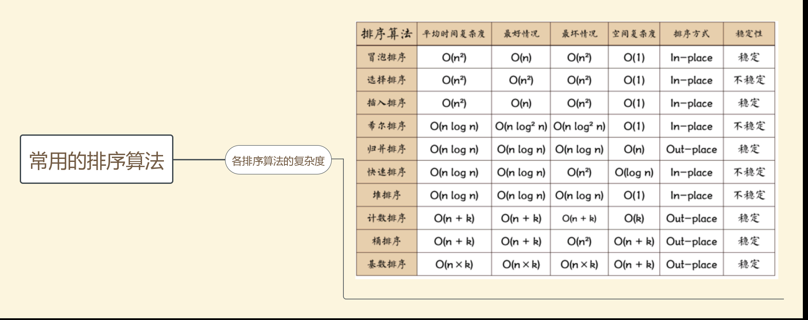

排序
快速排序
 基本思路

挖洞排序，随机选一个基准数，小于基准在左边，大于基准在右边，递归下去
取第一个数为基准，然后左右向中间靠，小于基准在左边，大于基准在右边，最后指针停止的数与第一个基准交换
注意！！！！要从右边先开始靠！！！


 衍生题目

1. 给定一个巨大的数组，找出其中的中值
2. 找出第k大的数
 
归并排序
 
 
## 求子数组的最大和
 
https://www.nowcoder.com/questionTerminal/459bd355da1549fa8a49e350bf3df484
 
负数变0
 
变式：**这道题还有一个求二叉树最大和路径的变式题**，想想非递归怎么做？？？
 
 
 
## 二叉树的非递归遍历
 
 
 
## N皇后问题
 
回溯递归法
 
变式
 
[word-search](https://www.nowcoder.com/questionTerminal/14bcbcb7ae3c40c9bdbc5a0861361c29?commentTags=Java)
 
 
 
```java
public class Solution {
    public boolean exist(char[][] board, String word) {
        int row = board.length;
        int col = board[0].length;
 
        for(int i = 0; i < row; i++){
            for(int j = 0; j < col; j++){
                boolean[][] visited = new boolean[row][col];
                if(search(i, j, board, 0, word, visited))return true;
            }
        }
        return false;
    }
    public boolean search(int i, int j, char[][] board, int k, String word, boolean[][] visited){
        if(k == word.length())return true;
        int row = board.length;
        int col = board[0].length;
        if(i < 0 || j < 0 || i >= row || j >= col || visited[i][j] == true || board[i][j] != word.charAt(k))return false;
        visited[i][j] = true;
        if(search(i - 1, j, board, k + 1, word, visited)
           || search(i + 1, j, board, k + 1, word, visited)
           || search(i , j - 1, board, k + 1, word, visited)
           || search(i , j + 1, board, k + 1, word, visited))return true;
        visited[i][j] = false;
        return false;
    }
```
 
 
 
 
 
## [reverse-nodes-in-k-group](https://www.nowcoder.com/questionTerminal/b49c3dc907814e9bbfa8437c251b028e?orderByHotValue=1&mutiTagIds=235&page=4&onlyReference=false)
 
以每k个为一组来翻转链表
 
 
 
## 缓存
 
### LRU cache
 
### 布隆过滤器
 
缓存击穿？
 
 
 
## 链表
 
1. 多加一个指针
 
2. 快慢指针
 
3. 多加一个链表头 eg. https://leetcode.com/problems/reverse-linked-list-ii/
 
4. 反转链表（递归&非递归）
 
   非递归 3个指针 (外面记录2个指针，循环额外记录一个)
 
   ```java
   class Solution {
       public ListNode reverseList(ListNode head) {
           if(head == null || head.next == null)return head;
           ListNode p = head;
           ListNode q = head.next;
           head.next = null;
           while(q != null){
               ListNode r = q.next;
               q.next = p;
               p = q;
               q = r;
           }
           return p;
       }
   }
   ```
 
   递归（记得把head.next置空）
 
   ```java
   class Solution {
       ListNode tail;
       public ListNode reverseList(ListNode head) {
           if(head == null || head.next == null) return head;
           revert(head);
           //断掉head，避免形成环
           head.next = null;
           return tail;
       }
 
       public ListNode revert(ListNode head){
           if(head.next != null){
               ListNode pre = revert(head.next);
               pre.next = head;
           }else{
               tail = head;
           }
           return head;
       }
   }
   ```
 
 
 
## 树
 
1. 先序遍历、后序遍历、中序遍历（递归&非递归）
 
   先序遍历（非递归）先访问自己，自己不断入栈，然后把指针移到左子树，直到null，再退栈把右子树入栈
 
   ```java
   class Solution {
       public List<Integer> preorderTraversal(TreeNode root) {
           List<Integer> list = new ArrayList<>();
           Stack<TreeNode> s = new Stack<>();
           TreeNode p = root;
           while(p != null || !s.empty()){
               while(p != null){
                   list.add(p.val);
                   s.push(p);
                   p = p.left;
               }
               if(!s.empty()){
                   TreeNode q = s.pop();
                   p = q.right;
               }
           }
           return list;
       }
   }
 
   ```
 
 
 
 
 
   中序遍历
 
```java
   class Solution {
       public List<Integer> inorderTraversal(TreeNode root) {
           List<Integer> list = new ArrayList<>();
           Stack<TreeNode> s = new Stack<>();
           TreeNode p = root;
           while(p != null || !s.empty()){
               while(p != null){
                   s.push(p);
                   p = p.left;
               }
               if(!s.empty()){
                   TreeNode q = s.pop();
                   list.add(q.val);
                   p = q.right;
               }
           }
           return list;
       }
   }
```
 
   后续遍历
 
```java
   class Solution {
       class PostNode{
           TreeNode root;
           boolean isFirst;
       }
 
       public List<Integer> postorderTraversal(TreeNode root) {
           List<Integer> list = new ArrayList<>();
           Stack<PostNode> s = new Stack<>();
           TreeNode p = root;
           while(p != null || !s.empty()){
               while(p != null){
                   PostNode n = new PostNode();
                   n.root = p;
                   n.isFirst = true;
                   s.push(n);
                   p = p.left;
               }
               if(!s.empty()){
                   PostNode q = s.pop();
                   if(q.isFirst == true){
                       q.isFirst = false;
                       s.push(q);
                       p = q.root.right;
                   }else{
                       list.add(q.root.val);
                   }
               }
 
           }
           return list;
       }
   }
```
 
 
 
   总结：
 
   二叉树遍历，非递归思路Traversal(root.left)相当于左子树入栈，Traversal(root.rihgt)相当于将右子树重复前面的操作
 
   后序遍历因为在递归中会退栈回到当前函数两次，所以需要判断栈顶是否访问了两次或者该栈顶的左右子树是否都被访问过！！！！
 
 
 
优先队列
 
如何实现？
 
1. Heap（Binary， Binomial，Fibonacci）
 
   fibonacci堆性能是最好的
 
2. Binary Search Tree
 
返回数据流中的第K大元素（用堆）
 
不用堆要每次排序， nklogk
 
优先队列实现nlogk
 
https://leetcode-cn.com/problems/kth-largest-element-in-a-stream/
 
```java
class KthLargest {
    PriorityQueue<Integer> q = new PriorityQueue<>();
    int k;
    public KthLargest(int k, int[] nums) {
        this.k = k;
        for(int n : nums){
            add(n);
        }
    }
 
    public int add(int val) {
        if(q.size() < k){
            q.offer(val);
        }else{
            int i = q.peek();
            if(val > i){
                q.poll();
                q.offer(val);
            }
        }
        return q.peek();
    }
}
```
 
priorityqueue就是堆的实现
 
 
 
## 滑动窗口
 
返回滑动窗口的最大值,如何维护队列
 
1）大顶堆 O(nlogk)
 
2）dequeue，双端队列 O(n)
 
去除无用比较，左侧永远是最大值
 
双端队列（deque，全名double-ended queue）是一种具有队列和栈性质的抽象数据类型。双端队列中的元素可以从两端弹出，插入和删除操作限定在队列的两边进行。
 
//todo 练习
 
 
 
 
## dfs？bfs？
 
 
 
## 最大上升子序列
 
DP，到最后一个值的最大值是确认的，用一维数组保存，每次到我这个值都和前面保存的结果对比得出最大值O(n^2)
 
O(nlogn)??

红黑树和AVL树（平衡二叉树）区别

生产者消费者模型优化
一个队列生产的时候是可以同时消费的，所以生产者一把锁，消费者一把锁，两把锁区别对待